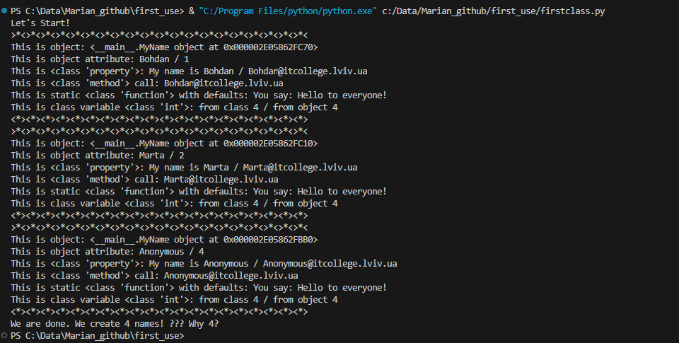
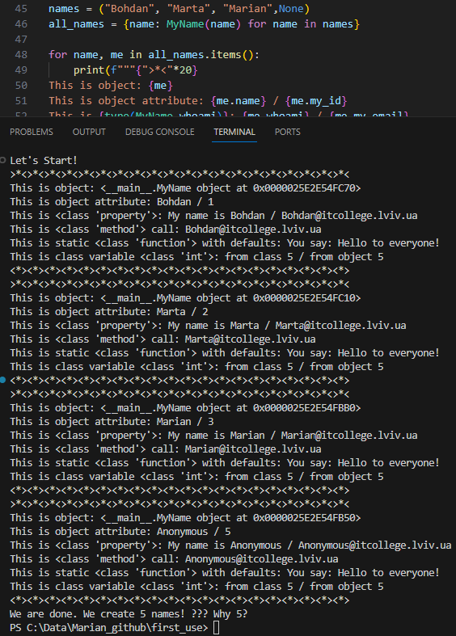

# Знайомство з ООП

## Задания
1.  вкажіть у звіті що вивела пограма або зробіть скріншот та вставте у звіт;
4. Модифікуйте програму додавши своє імя в список;

5. дайте відповідь на запитання:
 - 5.1 Чому коли передаємо значення None створюється обєкт з іменем Anonymous?
 - 5.2 Як змінити текст привітання при виклику методу say_hello()? Допишіть цю частину коду.
 - 5.3 Допишіть функцію в класі яка порахує кількість букв і імені (підказка: використайте функцію len());
 - 5.4 Порахуйте кількість імен у списку names та порівняйте із виведеним результатом. Дайте відповідь чому маємо різну кількість імен?

## Выполнение заданий
1. 
4. 
  - 5.1 Вопрос: Чому коли передаємо значення None створюється обєкт з іменем Anonymous?
Ответ: такое условие создание объекта\ициниализации в нашем классе. В случае передачи значения None выполняется метод anonymous_user (строка 7:  self.name = name if name is not None else self.anonymous_user().name #Class attributes / Instance variables)

  - 5.2 изменить текст приветсвия можно несколькими способами. Самый простой - это изменить в коде значение переменной message в статическом методе say_hello. Второй вариант, это превратить статический метод say_hello в метод класса.
  def say_hello(option):
        """Static method
        """
        if option == 0:
            message="Hello to everyone!" 
        else: message="Hi all!"
        return f"You say: {message}"

  - 5.3 
  def calculate_name_length(self):
        if isinstance(self.name, str):
            return len(self.name)
        else:
            raise TypeError("Атрибут 'name' должен быть строкой.")
  
  - 5.4 Разница в реальном количестве имен в словаре\списке (4) и количестве выведенном на экране (5) получается из-за того, что при инициализации объекта и использовании конструктора данного класса со значением параметра name=None происходит выполнение метода anonymous_user, который возвращает новый экземпляр класса с параметром name=Anonymus. Таким образом, счетчик total_names выполняет операцию инкримента дважды (первый раз для значения None, а второй раз Anonymus).

## Примечание
Данный репозиторий является кратким обзором и не предоставляет полной информации о каждой консоли. Для более подробной информации обращайтесь к официальным источникам.
