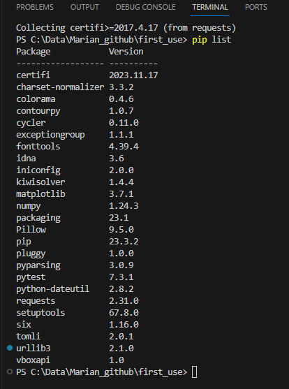
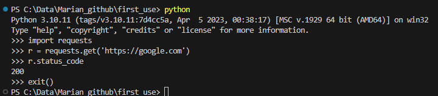
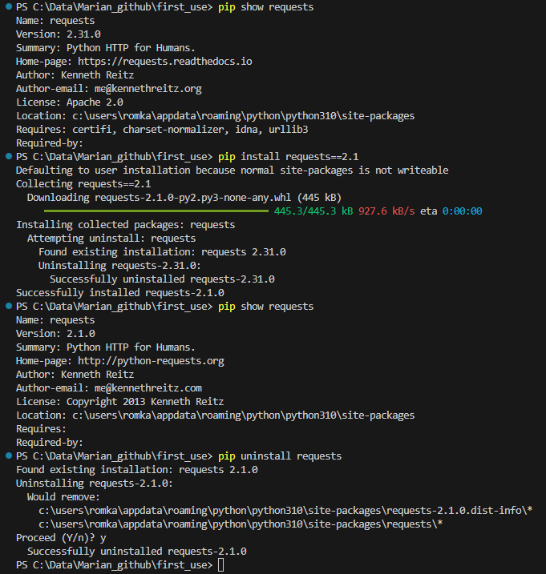
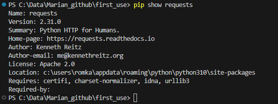
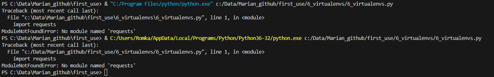

## Задания

# Віртуальні середовища
1.  Перевірте які бібліотеки вже інстальовані на Вашому компютері та вкажіть їх у звіті (скріншот або стрічки що вивелись);
2. Будь-яку сторонню бібліотеку можна встановити на комп'ютер за допомогою pip install команди та зразу почати її використовувати, наприклад встановимо бібліотеку requests:
pip install requests
python #Зайдіть в пайтон інтерпретатор
import requests
r = requests.get('https://google.com')
r.status_code
exit()
 - Вставте у звіт результат виконання команд (скріншот або стрічки що вивелись);

3. Даний спосіб інсталяції робить бібліотеку загальнодоступною для даної системи. Будь-яке оновлення бібліотеки буде застосоване до всіх Python проектів на Вашому комп'ютері;
pip show requests
pip install requests==2.1
pip show requests
pip uninstall requests
 - Вкажіть у звіті результат виконання команд.

# Робота у віртуальному середовищі

4. Для створення VENV та його активації виконайте команди:
python -m venv ./my_env
source my_env/Scripts/activate
pip install requests
deactivate
pip show requests
 - Вкажіть у звіті що вивела остання команда та чому?

# Робота з Pipenv

5. Вкажіть у звіті які команди можна виконувати за допомогою pipenv;
6. Переконайтесь що у Вас створились файли Pipfile та Pipfile.lock. Що в них знаходиться?
7. Створіть пайтон файл та запишіть в нього наступну програму:
import requests
response = requests.get('https://httpbin.org/')
for line in response.iter_lines():
  print(line)
Спробуйте запустити програму з Visual Studio. Запустіть програму з командної стрічки. Запустіть програму зайшовши у віртуальне середовище за допомогою команди pipenv shell. Результати запишіть у звіт.
8. Змініть інтерпретатор Python із Вашого середовища та виконайте скрипт через кнопку Run. Представте результат у звіті.

9. Що буде якщо виконати скрипт без активації віртуального середовища?

## Выполнение заданий
1. Результаты: 
2. Результаты: 
3. Результаты: 
4. Команда pip show requests выводит информацию о установленном пакете requests.
  Результаты: 
5. Основные команды pipenv:
  pipenv install: Устанавливает зависимости проекта на основе файла Pipfile.
  pipenv install package_name: Устанавливает конкретный пакет и добавляет его в файл Pipfile.
  pipenv install --dev package_name: Устанавливает пакет как зависимость разработки (для тестирования, разработки и т.д.).
  pipenv uninstall package_name: Удаляет пакет из виртуального окружения и обновляет файл Pipfile.
  pipenv lock: Создает файл Pipfile.lock, который фиксирует версии всех установленных пакетов.
  pipenv shell: Активирует виртуальное окружение. После выполнения этой команды вы будете в виртуальном окружении, где можно запускать Python-скрипты.
  pipenv run command: Запускает команду в виртуальном окружении, не активируя его.
  pipenv check: Проверяет наличие уязвимостей в установленных пакетах.
  pipenv graph: Выводит граф зависимостей проекта.
  pipenv --version: Выводит версию pipenv.
  pipenv --version
6. Файл Pipfile содержит информацию о зависимостях проекта на Python, включая пакеты и их версии. Файл Pipfile.lock фиксирует конкретные версии зависимостей, обеспечивая воспроизводимость среды разработки и предотвращая автоматическое обновление пакетов при установке.
7. При запуске кода из Visual Studio в консоль выводится код страницы сайта
При запуске из командной строки получаем ошибку ModuleNotFoundError: No module named 'requests'
При запуске из виртуальной среды в консоль выводится код страницы сайта
8. Результаты: 
9. Если выполнить скрипт Python без активации виртуальной среды, это может привести к нескольким потенциальным проблемам:
 - Если в проекте используються сторонние библиотеки, которые установлены в виртуальной среде, они могут не быть доступны в системном Python, и текущий скрипт может не работать корректно.
 - Если используется виртуальная среда с определенной версией Python, но выполняется скрипт с использованием другой версии, это может вызвать несовместимость версий.
 - Если имеется несколько проектов, каждый из которых требует свою уникальную среду, выполнение скрипта без активации соответствующей виртуальной среды может привести к конфликтам между версиями библиотек и другими зависимостями.
 - Установка или обновление библиотек в системном Python может внести изменения, затрагивающие другие проекты, работающие с этой же версией Python.